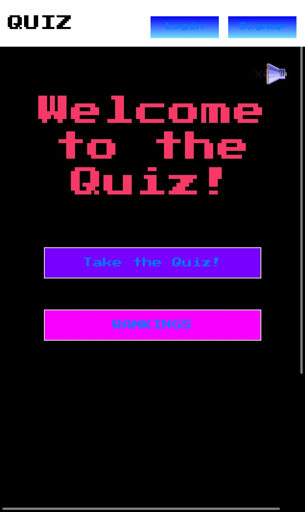
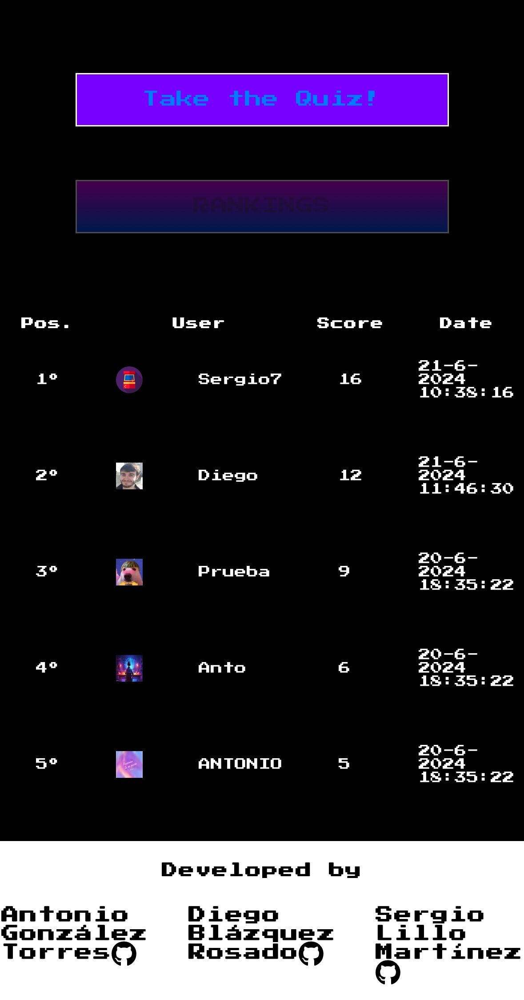
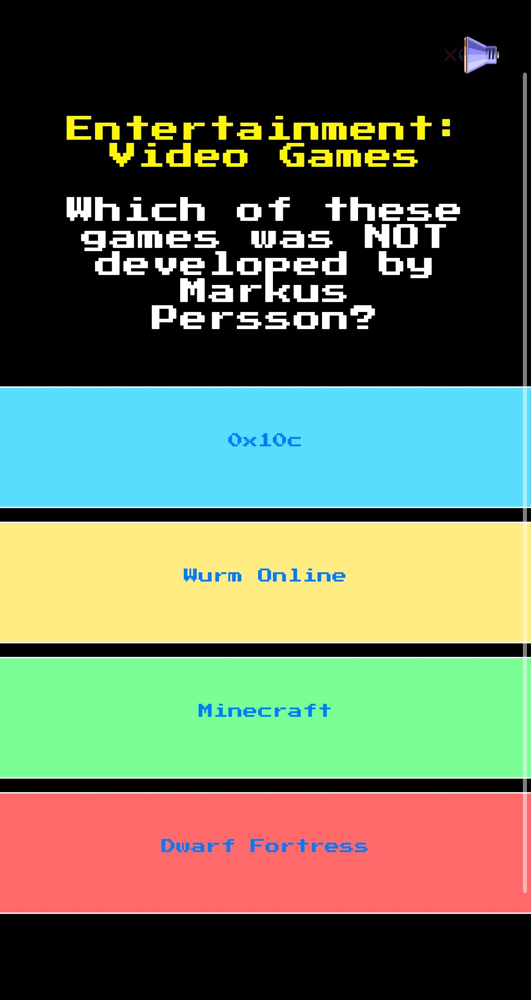
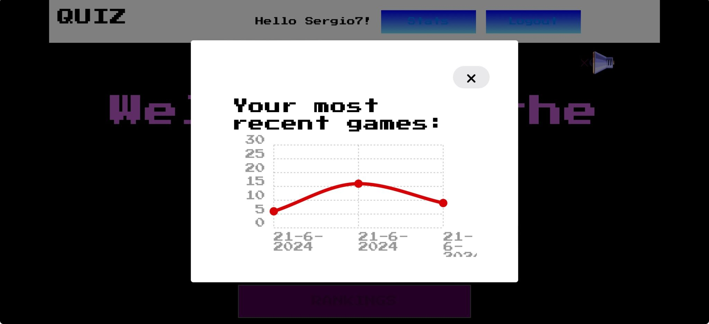

# Quiz App
 

**Link**: https://sergiolm7.github.io/quiz-js-equipo/

**Description**: This is a quiz application that displays 10 random quiz questions and saves your results. It also shows an overall ranking with top 10 results and also a stats section with your own last 10 tries punctuations displayed in a chart.

## Technologies Used

- **HTML5**: For the basic structure of the page.
- **CSS3**: Styles to make the interface pleasant and responsive.
- **JavaScript (JS)**: Implementation of quiz logic and page interactivity.
- **Firebase**: Used to store and manage user results.
- **Git Hub**: Used to manage versions control and deployment of the website.

## Tools Used

- **API OpenDTB**: Used to get quiz questions (https://opentdb.com/).
- **Chartist**: Used to paint the user stats chart (https://gionkunz.github.io/chartist-js/).
- **Normalize**: Used to normalize browsers styles.

## Features

1. **Main Page (`index.html`)**:
   - Displays the quiz title and includes sections for login, signup, overall ranking, start quiz questions, and player stats.
   - Includes an audio player to enhance the user experience.

2. **Questions Page(`pages/questions.html`)**:
   - Displays API questions one by one and goes to next one when clicked.
   - Alerts if the answer is correct or wrong.
   - Includes an audio player to enhance the user experience.

3.  **Results Page(`pages/results.html`)**:
   - Shows user's result and a message depending on the result.
   - Gives the option of save the result in Firebase if logged, and redirects to Sign Up if not logged.
   - Includes an audio player to enhance the user experience.

4.   **Styles (`styles.css`)**:
   - Defines the visual appearance of the application, using the `Press Start 2P` font for a retro gaming theme.
   - Ensures the application is responsive and visually appealing.

5. **JavaScript (`index.js`)**:
   - Handles quiz logic, generating random questions, and evaluating answers.
   - Implements Firebase authentication for user login and registration.
   - Stores and displays user results using Firebase Firestore for data storage.

6. **Firebase**:
   - Used for authentication (`firebase-auth.js`) and real-time database (`firebase-firestore.js` and `firebase-storage.js`).
   - Stores each user quiz results and allows comparison to generate an overall ranking.

## Usage

To run the application locally:
1. Clone this repository to your local machine.
2. Open the `index.html` file in your preferred web browser.

## Author

Developed by Antonio, Sergio y Diego.

## External Resources
- [Font Awesome](https://fontawesome.com): Used for several icons.
- [Google Fonts](https://fonts.google.com): Used for the `Press Start 2P` font.

---

This README provides an overview of the project and its structure. Be sure to customize it with specific details about your implementation and any other relevant information.
